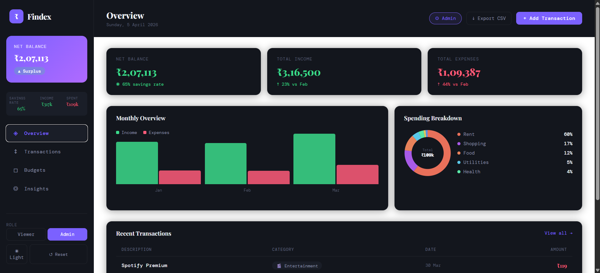
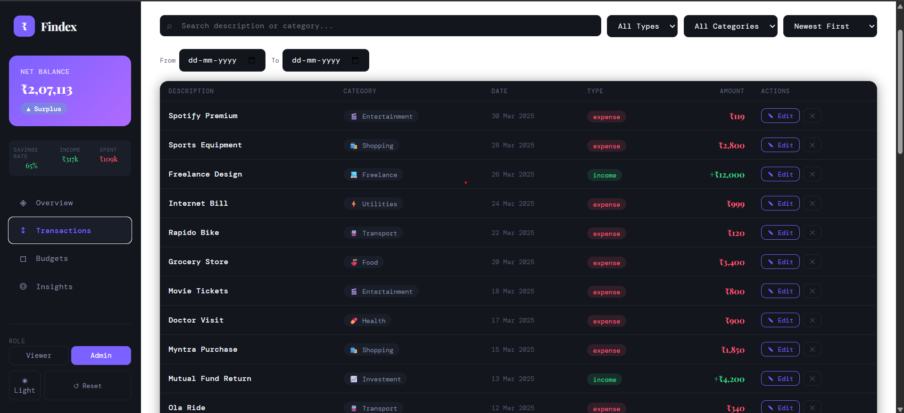
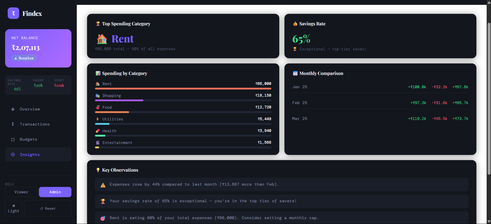
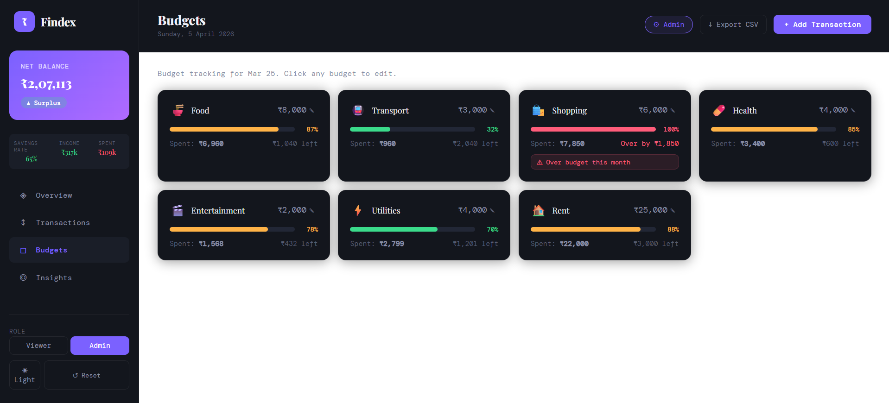

# 💸 FinTrack – Finance Dashboard

A modern finance dashboard built using React (Vite) to help users track income, expenses, and spending patterns through an intuitive and responsive interface.

---

## 📌 Overview

This project simulates a fintech dashboard where users can:

- View financial summaries (balance, income, expenses)
- Explore transactions
- Analyze spending patterns through charts
- Gain insights from their financial data

The focus of this project is on frontend design, state management, and user experience.

---

## 🚀 Features

### 📊 Dashboard Overview
- Displays total balance, income, and expenses
- Provides quick financial snapshot
- Clean card-based UI

### 💳 Transactions Section
- Lists all transactions with:
  - Date
  - Amount
  - Category
  - Type (Income / Expense)
- Structured in a readable table format

### 📈 Data Visualization
- Line chart for financial trends
- Pie chart for category-wise spending breakdown

### 💡 Insights Section
- Highlights useful observations such as:
  - Spending ratio
  - Expense trends

### 🎭 Role-Based UI (Simulated)
- Viewer → read-only
- Admin → can modify (extendable)

### ⚙️ State Management
- Managed using React state/hooks
- Handles transactions, filters, and UI updates

---

## 🛠 Tech Stack

- React (Vite)
- JavaScript / TypeScript
- CSS
- Recharts

---

## 📂 Project Structure

FIN-TECH/
├── src/
│   ├── components/
│   ├── context/
│   ├── data/
│   ├── App.jsx
│   └── main.jsx
├── index.html
├── package.json
├── vite.config.js
├── README.md

---

## ▶️ Setup Instructions

git clone https://github.com/Aritrraa/FIN-TECH.git
cd FIN-TECH
npm install
npm run dev

Open in browser:
http://localhost:5173

---

## 🌐 Deployment

Build Command: npm run build  
Output Directory: dist
https://fin-tech-qxq1.vercel.app/

---

## 📌 Design Approach

- Clean and intuitive UI
- Component-based architecture
- Scalable and maintainable code
- Responsive layout

---

## ⚠️ Assumptions

- Uses mock data
- No backend integration
- Role-based UI is simulated

---
## ⭐ Acknowledgment

Built as part of a frontend evaluation project to demonstrate UI, state management, and data visualization skills.

## 📸 Screenshots

### 🏠 Dashboard

### 💳 Transactions

### 📊 Analytics

---

## 🔮 Future Improvements

- Add/Edit/Delete transactions
- Data persistence (API/localStorage)
- Authentication
- Advanced filtering
- Mobile optimization

---

## 👨‍💻 Author

Aritra Das  
https://github.com/Aritrraa

---

## ⭐ If you like this project

Give it a ⭐ on GitHub — it helps a lot!
